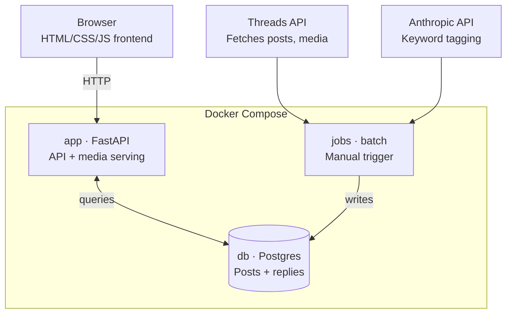
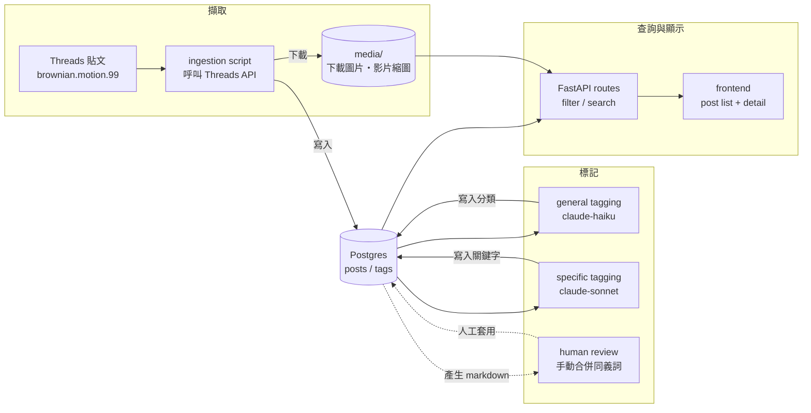
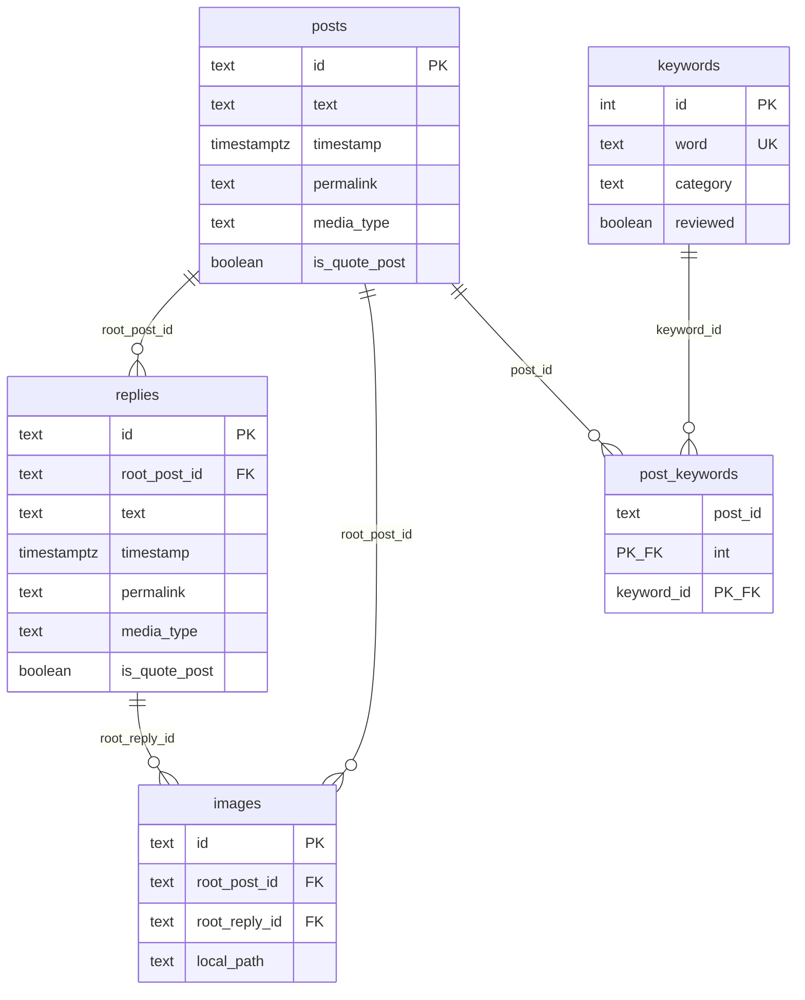
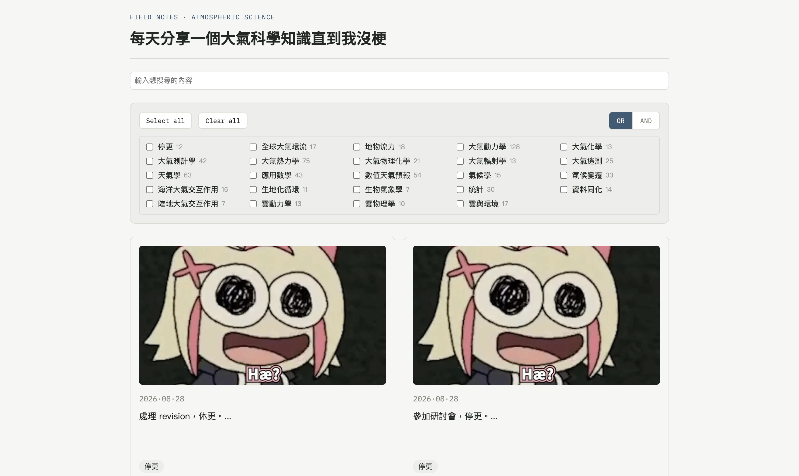
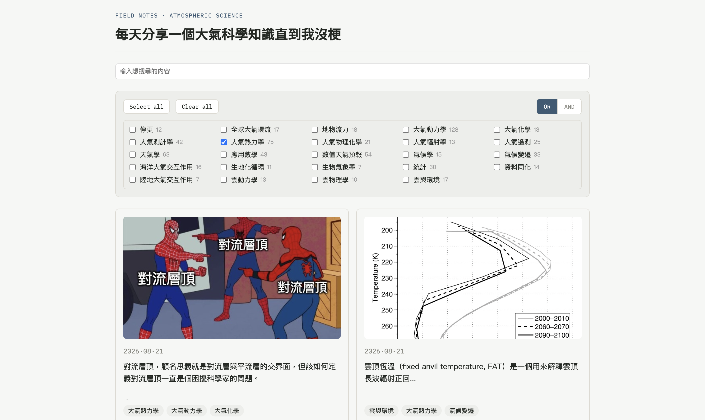
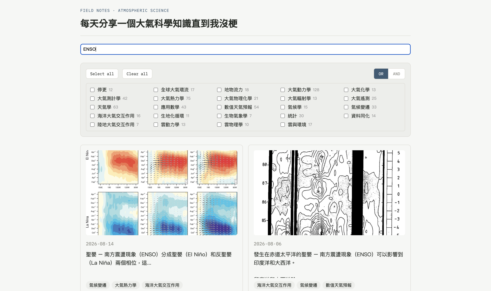
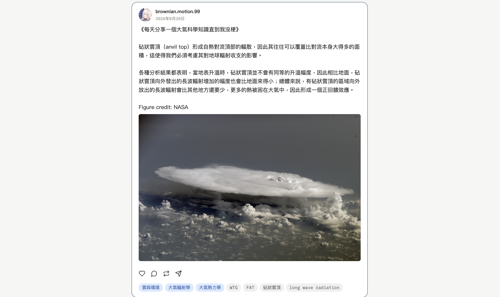

# threads-backup

科學傳播系列《每天分享一個大氣科學知識直到我沒梗》的備份。

《每天分享一個大氣科學知識直到我沒梗》是本人於 2025 年底開始於 threads 日更的科學傳播短文系列，目前已累積超過 200 篇短文。由於貼文數量的增加，現在已經很難單純透過記憶來尋找過去的貼文，再加上 threads 的搜尋功能基本上可說是聊勝於無，本人便萌生自建資料庫與搜尋系統的想法。

這個 Repo 的主要目的為：
1. 備份 threads 貼文
2. 方便查詢過去的貼文
3. 學習使用 Postgres 建置關聯式資料庫
4. 學習使用 html、css、javascript 打造前端系統
5. 學習 Docker 與雲端平台部署

這是一份個人 side project，需要特定帳號的 threads api token，分類與標記系統也是為了大氣科學知識特別設計，非通用工具，因此這邊主要展示架構設計與實作過程。

## Features

- 透過 threads api 自動抓取貼文、回覆、圖片與影片
- 使用 LLM 自動分類貼文並標記關鍵字
- 透過標記與內文動態搜尋內容
- 透過前端網頁與資料庫進行交互

## Architecture

這個服務由 app、jobs、db 三個部分組成：
- app：負責前端與後端交互的 api
- jobs：批次執行抓取、標記貼文工作，目前為手動觸發，未來規劃改成雲端排程自動執行
- db：儲存貼文、回覆、標記與圖片 id

透過 threads api 自動抓取貼文後寫入資料庫。透過 anthropic api 呼叫 claude-haiku 進行貼文分類、呼叫 claude-sonnet 生成關鍵字以標記貼文，LLM 生成之關鍵字需定期人工審核。透過由 html/css/js 建置之前端頁面查詢貼文。

## Database

- posts 儲存貼文主體。
- replies 儲存由 `@brownian.motion.99` 於貼文下方的回覆。
- images 儲存貼文或回覆附帶的圖片或影片，下載後存於 `local_path`。images 當中的一個物件同時只會對應到一則貼文或是一則回覆，其 root_post_id 與 root_reply_id 為彼此互斥的 foreign key。
- keywords 儲存貼文的關鍵字，keywords.word 具有 unique 限制，keywords.category 分為 general 與 specifc，general 作為貼文分類用，非必要不新增關鍵字；specific 則是由 LLM 根據貼文自動生成，需定期手動審核。
- post_keywords 為貼文與關鍵字的 junction table。

## Tech Stacks
- Framework: Python 3.12, FastAPI, vanilla JS
- Database: PostgreSQL (`psycopg3`)
- Containerization: Docker compose (app, jobs, db)
- Fetching posts with threads api
- Categorizing posts wtih `claude-haiku`, extracting keywords from posts with `claude-sonnet`

## Demo
> 
> 貼文列表頁

> 
> 可透過勾選關鍵字來篩選貼文

> 
> 可透過文字搜尋貼文

> 
> 模仿 threads 的貼文顯示介面